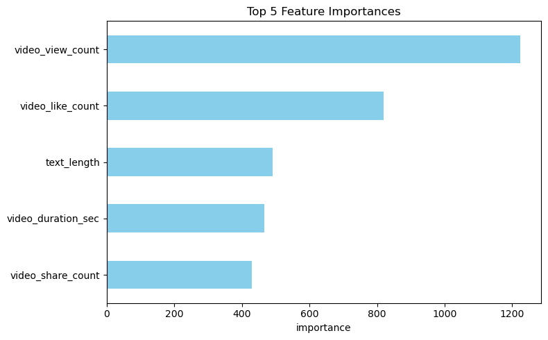

# 💻 **Project: Classifying TikTok Videos Using Machine Learning**

This notebook investigates a machine learning approach to classify TikTok videos as either **claims** or **opinions**, aiming to mitigate the spread of misinformation.  
It leverages Python-based data science libraries for data handling, feature extraction, and model development.

---

## 🔍 **Workflow Overview**

We'll structure the project as follows:
1. 🧠 Problem Definition  
2. 📦 Data  
3. 📈 Evaluation  
4. 🔑 Features  
5. 🤖 Modeling  
6. 🔬 Experimentation  

---

## 🧠 **Problem Definition**

**Goal**  
> Develop a model that distinguishes videos presenting **claims** from those expressing **opinions** to help reduce misinformation on the TikTok platform.

---

## 📦 **Data**

- **Source**: Google Advanced Data Analytics  
- **Format**: Tabular dataset with metadata and transcription of TikTok videos  
- **Target Variable**: `claim_status` – indicates whether the video presents a claim (1) or opinion (0)  

---

## 📈 **Evaluation**

> Our benchmark:  
If the model achieves **≥ 95% accuracy**, we consider the project viable for further productionization.

**Metrics to be used:**
- Accuracy 
- Precision/Recall (especially if imbalanced)  
- F1-score  
- ROC-AUC

---

## 🔑 **Features**

Below is the **data dictionary** describing the dataset's features:

| Feature Name               | Description |
|----------------------------|-------------|
| `claim_status`             | **Target**: Whether the video contains a factual claim (1) or opinion (0) |
| `video_id`                 | Unique identifier for each video |
| `video_duration_sec`       | Duration of the video in seconds |
| `video_transcription_text` | Text transcribed from the video (used for NLP features) |
| `verified_status`          | Whether the video author is verified |
| `author_ban_status`        | Whether the author has been banned before |
| `video_view_count`         | Number of views the video has received |
| `video_like_count`         | Number of likes |
| `video_share_count`        | Number of shares |
| `video_download_count`     | Number of downloads |
| `video_comment_count`      | Number of comments |

These features will be analyzed for importance and preprocessing steps such as normalization, transformation, and tokenization will be applied where necessary.

---

## 🧠 Machine Learning Model Development

### ⚠️ Risk Context:
- **False positives**: Wasting time on non-violating videos.
- **False negatives**: Failing to catch harmful content.
- Emphasis is placed on **recall** to minimize **false negatives**.

### ✅ Models Developed:
- **Random Forest**
- **XGBoost (Gradient Boosting)**
- **LightGBM**

LightGBM showed **superior validation performance** and was selected as the final model.

### 🧪 Final Test Results:

| Metric     | Score   |
|------------|---------|
| Accuracy   | 0.9984  |
| Precision  | 0.9984  |
| Recall     | 0.9984  |
| F1 Score   | 0.9984  |

### 🔍 Feature Importance:
- Top 5 features: Video engagement metrics  
- Next 5 features: Vectorized text features from transcription (lower importance) 

The top 5 most important features (from LightGBM) are shown below:

---